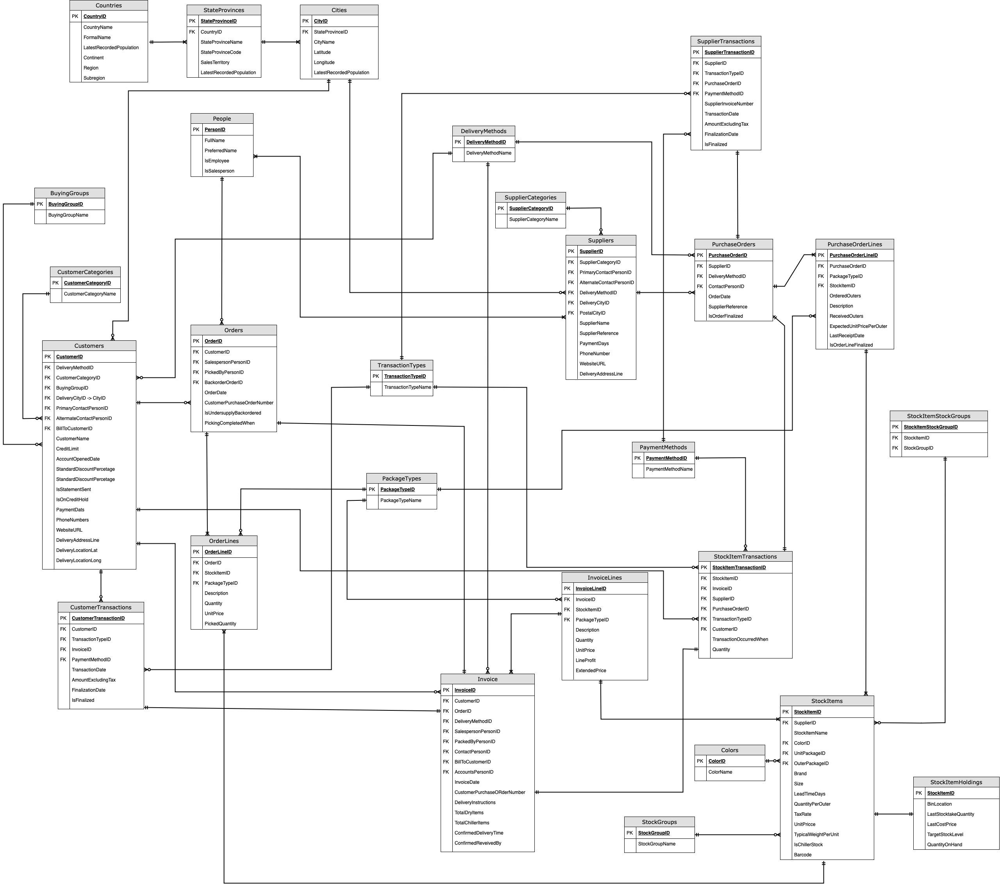
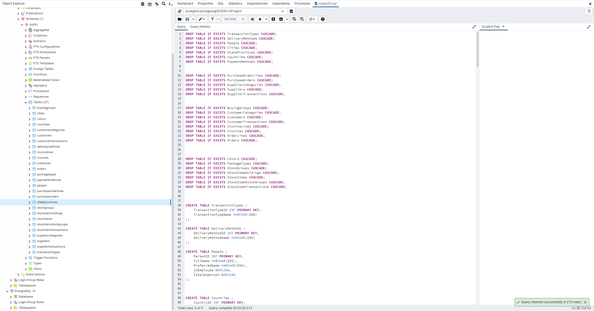
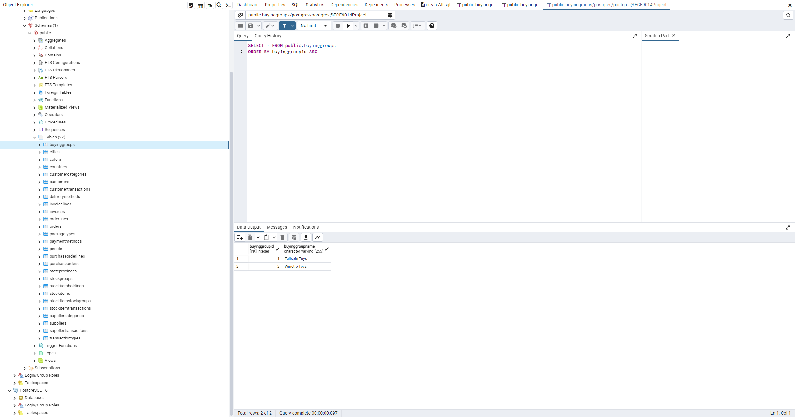
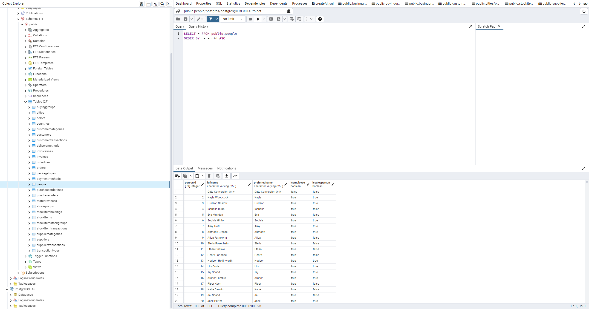
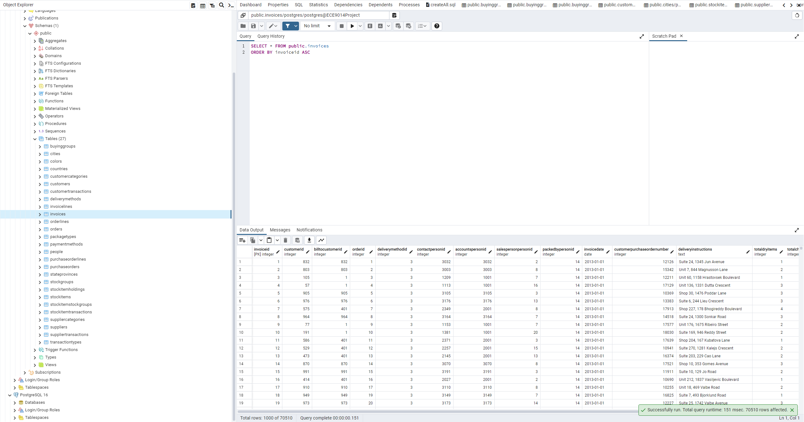

# ECE 9014 Project Deliverable #1

## Table of Contents
1. [Contributors](#contributors)
3. [Relevant Links](#relevant-links)
4. [Dataset](#dataset)
    
    3.1. [Description](#description)

    3.2. [Business Rules](#business-rules)

    3.2. [Entity Relationship Diagrams](#entity-relationship-diagrams)
5. [SQL Implementation](#sql-implementation)

    4.1. [Relation Model](#relation-model)
   
    4.2. [SQL Schema](#sql-schema)
   
    4.3. [Screenshots](#screenshots)

## Contributors
- Weixi Sun email address: wsun293@uwo.ca
- Xutong Li email address: xli3494@uwo.ca
- En Yang email address: eyang87@uwo.ca

## Relevant Links

- [Dataset Source](https://www.kaggle.com/datasets/pauloviniciusornelas/wwimporters)
- [Entity Relationship Diagrams](https://app.diagrams.net/?src=about#G1J-wjOcQm5Tx5u6U7EXWBaevWjFE6iLkM)
- [GitHub](https://github.com/XutongLi-UWO/ECE9014-Project)

## Dataset

### Description

This project is divided into four sections: *Application*, *Purchase*, *Sales*, and *Warehouse*. 

*Applications* give some basic information for other sections, such as person and location information. *Purchase* tracks transactions with suppliers, *Sales* records transactions with customers, and *Warehouse* records how many stock goods they have.

Overall, these tables provide vital information that supports a logistics organisation in correctly managing and tracking its sales, purchases, orders, and warehousing operations.

#### Applications

In the applications section, there are 7 tables recorded, including geographical location, such as cities, states, and nations; delivery methods; payment methods; transaction kinds; and persons participating in the process are examples of these. 

**Relation**: This section contains the fundamental information that will be needed in other sections such as *Purchase*, *Sales*, and *Sarehouse*. As it may supply the delivery method, location, and person type.

- The table of *Cities* contains CityID, CityName, StateProvinceID, Latitude, Longitude, and LatestRecordedPopulation, which display detailed information about nearly 37,000 cities, including their names, location, and population. where CityID is the primary key used to identify cities.

- The table of *Countries* contains 7 columns: CountryID, CountryName, FormalName, LatestRecordedPopulation, Continent, Region, and Subregion, which depict information about the countries, with CountryID serving as the primary key that uniquely identifies the countries.

- The table of *StateProvinces* comprises 6 columns: StateProvinceID, StateProvinceCode, StateProvinceName, CountryID, SalesTerritory, and LatestRecordedPopulation, which reveal significant information about the states, with StateProvinceID serving as the main key that uniquely identifies the Provinc

- The table of *Persons* comprises 5 columns: PersonID FullName, PreferredName, SearchName, IsEmployee, IsSalesperson. It gives information about the person and can be used to determine if the person is an employee or a salesperson.

- The table of *Delivery* methods, the table of *PaymentMethods*, and the table of *TransactionTypes* connect each ID with its specific type.

#### Purchase

In the purchase  section, there are Purchase Orders, Purchase Order Lines, Suppliers, Supplier Categories, and Supplier Transactions, totaling 5 tables, used to manage purchases and their associated details. 

**Relation**: In this section, each *Purchase Order* has at least one *Purchase Order Line*, and each *Purchase Order Line* is associated with at least one *Purchase Order*. Meanwhile, *Suppliers* are assigned to at least one *Category*, but a *Category* may have no or numerous *Suppliers*. And each *SupplierTransaction* should have one or no more than one *Supplier*.

- The table of *PurchaseOrders* contains eight columns: PurchaseOrderID, SupplierID, OrderDate, DeliveryMethodID, ContactPersonID, ExpectedDeliveryDate, SupplierReference, and IsOrderFinalized.
    - PurchaseOrderID is the primary key that identifies the purchase order uniquely;
    - SupplierIDs identify which supplier are engaged;
    - OrderDate shows the date and time the order was placed;
    - DeliveryThe MethodID identifies how it is delivered;
    - ContactPersonID identifies the contact person.

- The table of *PurchaseOrderLine* contains PurchaseOrderLineID, PurchaseOrderID, StockItemID, OrderedOuters, Description, ReceivedOuters, PackageTypeID, ExpectedUnitPricePerOuter, LastReceiptDate, and IsOrderLineFinalized.
    - PurchaseOrderLineID is the primary key that identifies the purchase order line uniquely.     
    - The PurchaseOrderID identifies the involved Purchase order.
    - The StockItemID identifies the item that was put on this OrderLine.
    - PackageTypeID identifies the type of package.

- The table of *Suppliers* contains 15 columns : SupplierID, SupplierName, SupplierCategoryID, PrimaryContactPersonID, AlternateContactPersonID, DeliveryMethodID, DeliveryCityID, PostalCityID, SupplierReference, PaymentDays, PhoneNumber, WebsiteURL, DeliveryAddressLine, DeliveryLocationLat, DeliveryLocationLong, which contains specific information on each supplier, such as their category ID, principal contact person, delivery city, and methods.

    - The primary key that uniquely identifies the provider is SupplierID.
    - The DeliveryMethodID identifies how it is delivered.
    - The Supplier Categories Table includes 9 distinct categories such as toys and apparel.

- The table of *SupplierTransactions* has 13 columns : SupplierTransactionID, SupplierID, TransactionTypeID, PurchaseOrderID, PaymentMethodID, SupplierInvoiceNumber, TransactionDate, AmountExcludingTax, TaxAmount, TransactionAmount, OutstandingBalance, FinalizationDate, IsFinalized that record critical information such as supplier, transaction type, linked purchase order, and payment method.
    - The primary key that uniquely identifies this transaction is SupplierTransactionID.
    - This transaction is linked to its provider via SupplierID.
    - PurchaseOrderID assists in locating the relevant purchase order.

#### Sales
In the sales section, it consists of eight tables, including *Customers*, *Customer Categories*, *Buying Groups*, *Customer Transactions*, *Invoices*, *Invoice Lines*, *Orders*, and *Order Lines*. 

**Relation**: Each *Order* has at least one *Order Line*, and each *Order Line* is associated with at least one *Order*. Meanwhile, *Customers* are assigned to at least one *Category*, but a *Category* may have no or numerous *Customers*. And each *Customer Transaction* should have one or no more than one *customer*.

- The table of *Customers* has 20 columns: *CustomerID*, *CustomerName*, *BillToCustomerID*, *CustomerCategoryID*, *BuyingGroupID*, *PrimaryContactPersonID*, *AlternateContactPersonID*, *DeliveryMethodID*,  *DeliveryCityID*, *CreditLimit*, *AccountOpenedDate*, *StandardDiscountPercentage*, *IsStatementSent*, *IsOnCreditHold*, *PaymentDays*, *PhoneNumber*, *WebsiteURL*, *DeliveryLocationLat*,

    - *CustomerID* is the primary key that uniquely identifies the Customer.

    - *DeliveryMethodID* is provided to identify the selected delivery method by the consumer.

    - *CustomerCategories* categorises clients into eight types.

- The table of *CustomerTransactions* has 12 columns: CustomerTransactionID, CustomerID, TransactionTypeID, InvoiceID, PaymentMethodID, TransactionDate, AmountExcludingTax TaxAmount, TransactionAmount, OutstandingBalance, FinalizationDate, IsFinalized, which records detailed information about each customer transaction, including the transaction type and payment method;

    - *CustomerTransactionID* is The primary key that uniquely identifies this transaction.

    - *CustomerID* identifies the involved customer.

    - *InvoiceID* identifies the involved invoice.

- The table of *Invoices* has 16 columns: InvoiceID, CustomerID, BillToCustomerID, OrderID, DeliveryMethodID, ContactPersonID, AccountsPersonID, SalespersonPersonID, PackedByPersonID, InvoiceDate, CustomerPurchaseOrderNumber, DeliveryInstructions, TotalDryItems, TotalChillerItems, ConfirmedDeliveryTime, ConfirmedReceivedBy, which contain pertinent details such as total dry products and total chiller items.

- The table of *Invoice Lines* contains : InvoiceLineID, InvoiceID, StockItemID, Description, PackageTypeID, Quantity, UnitPrice, TaxRate, TaxAmount, LineProfit, and ExtendedPrice, which contain detailed information about each line in the invoice, including the stock item, quantity, unit price, tax rate, and line profit.

    - *InvoiceLineID* is the primary key that uniquely identifies the invoice line.
    - *InvoiceID* connects it with the belonged invoice.

- The table of Orders contains 11 columns: OrderID, CustomerID, SalespersonPersonID, PickedByPersonID, ContactPersonID, BackorderOrderID, OrderDate, ExpectedDeliveryDate, CustomerPurchaseOrderNumber, IsUndersupplyBackordered, PickingCompletedWhen that record relevant contact persons and dates such as order date and expected delivery date.

    - OrderID is the primary key that uniquely identifies the order.
    - CustomerID identifies the consumer.

- The table of OrderLines has 10 columns: OrderLineID, OrderID, StockItemID, Description, PackageTypeID, Quantity, UnitPrice, TaxRate, PickedQuantity, and PickingCompletedWhen columns, which contain information about the items in the order, such as the stock item, package type, quantity, unit price, and tax rate.

    - OrderLineID is the primary key that uniquely identifies the order line.
    - OrderID is the unique identifier for the order to which this order line belongs.
    - StockItemID indicates the type of stock item ordered, while more information is available in the stock item.

#### Warehouse

In the warehouse part, it includes 9 tables such as *Warehouse*, *Cold Room Temperatures*, *Colors*, *Package Types*, *Stock Groups*, *Stock Items*, *Stock Items Holdings*,*Stock Items Stock Groups*, and *Stock Items Transactions*.  

**Relation**: A *stock item* is required for each *stock item transaction*, however a *stock item* might have numerous *transactions*. 

- The table of *ColdRoomTemperatures* has 4 columns: ColdRoomTemperatureID, ColdRoomSensorNumber, RecordedWhen, and Temperature columns in the Table of Cold Room Temperatures are used to update the temperatures of the cold rooms, with details such as sensor number, recorded time, and temperature.

-  The  Table of *StockItems* contains *StockItemID*, *StockItemName*, *SupplierID*, *ColorID*, *UnitPackageID*, *OuterPackageID*, *Brand*, *Size*, *LeadTimeDays*, *QuantityPerOuter*, *IsChillerStock*, *Barcode*, *TaxRate*,* UnitPrice*, *RecommendedRetailPrice*, and *TypicalWeightPerUnit* which display detailed information about each item, including its name, supplier, unit package and colour, outer package, brand, size, and quantity per outer.

    - *StockItemID* is the primary key that uniquely identifies each Stock Item.
    - *SupplierID* identifies the involved supplier.

- The Table of *StockItemsHoldings* contains: *StockItemID*, *QuantityOnHand*, *BinLocation*, *LastStocktakeQuantity*, *LastCostPrice*, *ReorderLevel*, and *TargetStockLevel*, which display information about the location of each stock item, including the bin location, quantity on hand, and reorder level.

    - *StockItemID* is the primary key that uniquely identifies each Stock Item.

- The table of *StockItemsStockGroups* relates each stock item to its corresponding stock group.

- The table of *StockItemsTransactions* has 9 columns: StockItemTransactionID, StockItemID, TransactionTypeID, CustomerID, InvoiceID, SupplierID, PurchaseOrderID, TransactionOccurredWhen, and Quantity columns, which document the details of each transaction involving a stock item, such as the customer, invoice, supplier, transaction type, and purchase order.

    - *StockItemTransactionID* is the primary key that uniquely identifies this transaction.

    - *StockItemID* identifies the stock item in question.

    - *TransactionTypeID* identifies the type of transaction, which can be referred to in the Application section.

    - *CustomerID* identifies the consumer in question.

    - *InvoiceID* links the transaction to the associated invoice.

    - *SupplierID* identifies the supplier in question.

- The table of *VehicleTemperatures* uses sensor numbers to record the temperature of registered vehicles at a certain time. 

- The table of *Colours* records the names of 36 different colours.

- The table of *PackageTypes*: Bags and trays are among the 14 package kinds listed in.

- The table of *StockGroups* divides things into ten categories, such as apparel and novelty items.

### Business Rules
- Each country, state/province, and city has a unique ID.
- Each state/province belongs to one and only one country, every country must have at least one associated state/province.
- Each city belongs to one and only one state/province, and every state/province must have at least one associated city. 
- Each customer must be associated with a delivery city, A city can be associated with zero to many customers for delivery purposes.
- Every customer must belong to a buying group, and every buying group can have zero or more customers associated with it.
- Every customer must be categorized under a specific customer category, every customer category can have zero or more customers under it.
- Each customer must have a primary contact person and can optionally have an alternate contact person.
- A customer can have zero or more customer transactions, every customer transaction must correspond to one and only one customer.
- Each customer transaction corresponds to one and only one invoice, each invoice is associated with one and only one customer transaction.
- Each customer can have multiple orders, but every order is associated with only one specific customer.
- Each customer is assigned a specific delivery method, and a particular delivery method may be chosen by zero or one or multiple customers.
- Every customer can have zero to many invoices, but each invoice is uniquely associated with a specific customer.
- Each customer transaction is associated with a specific transaction type, while a single transaction type can be linked to zero, one, or multiple customer transactions.
- Each supplier transaction is associated with a specific transaction type, while a single transaction type can be linked to zero, one, or multiple supplier transactions.
- Each single person may be responsible for picking up multiple orders, but every order is specifically assigned to a single person for pickup.
- Each order consists of one or more order lines, and every order line is associated with a specific order.
- Each order line is associated with one specific package type, but a package type can be associated with zero or many order lines.
- Each customer can be associated with zero or many stock item transactions, but every stock item transaction is a result of changes made by one and only one specific customer.
- Each order corresponds to exactly one invoice, and each invoice is associated with exactly one specific order.
- An invoice is associated with exactly one delivery method, while a delivery method can be linked to zero, one, or multiple invoices.
- Every supplier is associated with one or more individuals from the "people" database, individuals from the "people" database may be associated with a specific supplier.
- Each city can host zero to many suppliers, but every supplier is located in only one specific city.
- Each order line corresponds to one specific stock item. However, a single stock item can be associated with zero, one, or multiple order lines.
- Each stock item must correspond to a purchase order line, but each purchase order line might correspond to one or multiple stock items.
- Every stock item must have a payment method, but each payment method might not include a stock item transaction or might include multiple ones.
- Each stock item must correspond to stock item stock groups, but stock item stock groups might not contain any stock items or might contain multiple ones.
- Each stock item must correspond to a stock item holding, and each stock item holding must also correspond to a stock item.
- Each stock item must correspond to a stock item group, but each stock item group might not include any stock items or might include multiple ones.
- Each stock item must correspond to an invoice line, but each invoice line might correspond to one or multiple stock items.
- Each stock item must correspond to a color, but each color might not include any stock items or might include multiple ones.
- Every supplier can have multiple or no purchase orders, but each purchase order must correspond to a supplier.
Each supplier must correspond to a supplier category, but each supplier category might not include any suppliers or might include multiple ones.
- Every purchase order must belong to one of the purchase order lines, but a purchase order line might not contain any purchase orders or might contain multiple ones.
- Every purchase order must generate a supplier transaction, and every supplier transaction must correspond to a purchase order.
- Each purchase order must correspond to a payment method, but the payment method might not include any purchase orders or might include multiple ones.
- Each supplier transaction must correspond to a payment method, but the payment method might not include any supplier transactions or might include multiple ones.
- Every stock item transaction must correspond to an invoice, and every invoice must correspond to a stock item transaction.
- Every stock item transaction must correspond to a transaction type, but each transaction type might not include any stock item transactions or might include multiple ones.
- Each purchase order line must correspond to a package type, but the package type might not include any purchase order lines or might include multiple ones.
- Each invoice line must correspond to a package type, but the package type might not include any purchase order lines or might include multiple ones.
- Each invoice must correspond to an invoice line, but the invoice line might not include any invoices or might include multiple ones.
- Each supplier must correspond to a supplier category, but the supplier category might not include any suppliers or might include multiple ones.

### Entity Relationship Diagrams

## SQL Implementation

### Relation Model

#### Applications:

- Application.TransactionTypes (3NF)

| TransactionTypeID(PK) | TransactionTypeName |
|-----------------------|-------------------------|

- Application.DeliveryMethods (3NF)

| DeliveryMethodID(PK) | DeliveryMethodName |
|----------------------|------------------------|

- Application.People(3NF)

| PersonID(PK) | FullName | PreferredName | IsEmployee | IsSalesperson |
|----------|--------------|-----------------------|------------|--------------|

-  Application.StateProvinces (3NF)

| StateProvinceID(PK) | CountryID(FK) | StateProvinceName | StateProvinceCode | SalesTerritory | LatestRecordedPopulation |
|-----------|-------------|----------------|--------|-----------|----------------|

- Application.PaymentMethods (3NF)

| PaymentMethodID(PK) | PaymentMethodName |
|---------------------|-----------------------|

- Application.Countries (3NF)

| CountryID(PK) | CountryName | FormalName | LatestRecordedPopulation | Continent | Region | Subregion |
|--------|-----------|------------|-------------------|--------|------|-----------|

- Application.Cities (3NF)

| CityID(PK) | StateProvinceID(FK) | CityName | Latitude | Longitude | LatestRecordedPopulation |
|-------|-----------|-------------|------------|------------|--------------------|

#### Purchasing:

- Purchasing.SupplierTransactions(3NF)

| SupplierTransactionID(PK) | SupplierID(FK) | TransactionTypeID(FK) | PurchaseOrderID(FK) | PaymentMethodID(FK) | SupplierInvoiceNumber | TransactionDate | AmountExcludingTax | FinalizationDate | IsFinalized |
|----------|-----|--------|-------|--------|---------|-------|---------|-------|-----|

- Purchasing.Suppliers (3NF)

| SupplierID(PK) | SupplierCategoryID(FK) | PrimaryContactPersonID(FK) | AlternateContactPersonID(FK) | DeliveryMethodID(FK) | DeliveryCityID(FK) | PostalCityID(FK) | SupplierReference | PaymentDays | PhoneNumber | WebsiteURL | DeliveryAddressLine | SupplierName |
|-----|-----|-------|--------|--------|------|-----|-----|------|-----|-----|-----|-------|

- Purchasing.SupplierCategories (3NF)

| SupplierCategoryID(PK) | SupplierCategoryName |
|------------------------|--------------------------|

- Purchasing.PurchaseOrders (3NF)

| PurchaseOrderID(PK) | SupplierID(FK) | DeliveryMethodID(FK) | ContactPersonID(FK) | SupplierReference | IsOrderFinalized | OrderDate |
|------------|--------|--------|------------|------------|------------|-----------|

- Purchasing.PurchaseOrderLines (3NF)

| PurchaseOrderLineID(PK) | PurchaseOrderID(FK) | StockItemID(FK) | OrderedOuters | Description | ReceivedOuters | PackageTypeID | LastReceiptDate | IsOrderLineFinalized |
|-----------|---------|-------|--------|-------|--------|--------|--------|----------|

#### Sales:

- Sales.Orders (3NF)

| OrderID(PK) | CustomerID(FK) | SalespersonPersonID(FK) | PickedByPersonID(FK) | ContactPersonID(FK) | BackorderOrderID(FK) | OrderDate | CustomerPurchaseOrderNumber | IsUndersupplyBackordered | PickingCompletedWhen |
|-----|------|--------|--------|-------|-------|-----|------------|----------|---------|

- Sales.CustomerCategories (3NF)

| CustomerCategoryID(PK) | CustomerCategoryName |
|------------------------|--------------------------|

- Sales.OrderLines (3NF)

| OrderLineID(PK) | OrderID(FK) | StockItemID(FK) | PackageTypeID(FK) | Quantity | UnitPrice | PickedQuantity | Description |
|----------|-------|----------|---------|------------|--------|--------|-----------|

- Sales.BuyingGroups (3NF)

| BuyingGroupID(PK) | BuyingGroupName |
|-------------------|---------------------|

- Sales.Invoices (3NF)

| InvoiceID(PK) | CustomerID(FK) | BillToCustomerID(FK) | OrderID(FK) | DeliveryMethodID(FK) | ContactPersonID(FK) | AccountsPersonID(FK) | SalespersonPersonID(FK) | PackedByPersonID(FK) | InvoiceDate | CustomerPurchaseOrderNumber | DeliveryInstructions | TotalDryItems | TotalChillerItems | ConfirmedDeliveryTime | ConfirmedReceivedBy |
|----|----|-----|---|-----|-----|-----|------|-----|----|--------|-----|----|-----|------|------|

- Sales.InvoiceLines(3NF)

| InvoiceLineID(PK) | InvoiceID(FK) | StockItemID(FK) | PackageTypeID(FK) | Quantity | UnitPrice | LineProfit | ExtendedPrice | Description |
|----------|-------|---------|--------|----------|-------|-------|-------|----------|

- Sales.CustomerTransactions (3NF)

| CustomerTransactionID(PK) | CustomerID(FK) | TransactionTypeID(FK) | InvoiceID(FK) | PaymentMethodID(FK) | TransactionDate | AmountExcludingTax | FinalizationDate | IsFinalized |
|------------|-------|---------|------|---------|--------|----------|--------|------|

- Sales.Customers (3NF)

| CustomerID(PK) | BillToCustomerID(FK) | CustomerCategoryID(FK) | BuyingGroupID(FK) | PrimaryContactPersonID(FK) | AlternateContactPersonID(FK) | DeliveryMethodID(FK) | DeliveryCityID(FK) | CreditLimit | AccountOpenedDate | StandardDiscountPercentage | IsStatementSent | IsOnCreditHold | PaymentDays | PhoneNumber | WebsiteURL | DeliveryAddressLine | DeliveryLocationLat | DeliveryLocationLong | CustomerName |
|---|----|----|----|----|-----|-----|----|----|---|----|------|----|----|----|----|---|----|----|-----|

#### Warehouse:

- Warehouse.StockItemStockGroups (3NF)

| StockItemStockGroupID(PK) | StockItemID(FK) | StockGroupID(FK) |
|---------------------------|-----------------|------------------|

- Warehouse.StockItemTransactions (3NF)

| StockItemTransactionID(PK) | StockItemID(FK) | TransactionTypeID(FK) | CustomerID(FK) | InvoiceID(FK) | SupplierID(FK) | PurchaseOrderID | TransactionOccurredWhen | Quantity |
|------------|-------|---------|-------|------|------|---------|-------------|------|

- Warehouse.StockItems (3NF)

| StockItemID(PK) | SupplierID(FK) | ColorID(FK) | UnitPackageID(FK) | OuterPackageID(FK) | StockItemName | Brand | Size | LeadTimeDays | QuantityPerOuter | IsChillerStock | Barcode | TaxRate | UnitPrice | RecommendedRetailPrice | TypicalWeightPerUnit |
|-----|------|----|----|-----|------|---|---|-----|------|-----|----|----|----|--------|-------|

- Warehouse.StockItemHoldings (3NF)

| StockItemID(PK) | QuantityOnHand | BinLocation | LastStocktakeQuantity | LastCostPrice | ReorderLevel | TargetStockLevel |
|---------|-----------|---------|---------------|----------|----------|------------|

- Warehouse.StockGroups (3NF)

| StockGroupID(PK) | StockGroupName |
|------------------|--------------------|

- Warehouse.PackageTypes (3NF)

| PackageTypeID(PK) | PackageTypeName | 
|-------------------|---------------------|

- Warehouse.Colors (3NF)

| ColorID(PK) | ColorName |
|-------------|---------------|

## SQL Schema
- Our project is based on python
- Need install python **psycopg2**
- Open a new Qury Tool in pgAdmin4
- Open main/createAll.sql then run -- This process is to create new tables in local host database
- Open terminal/command line, go to project dir, run the insertAll.py, then the terminal/command line will ask the informations of your local database, type in the informations

## Screenshots

#### The initial table:

#### Few examples of the tables:

- StockItemHoldings

- People
  

- Invoices
  

